## Microsoft Linux

> **Description:**
Microsoft's latest addition to the world of Open Source: a flag checker...
**Attachment file:**
[m<3l.exe](https://static.cor.team/uploads/646804dc1464496e49422efa4ca83cf62f82f080e3d62a40f2188c97740d042d/m%3C3l.exe)

Open file with DiE:


elf file but end with .exe. run in linux env

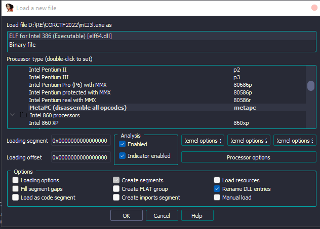

lib `elf.dll` usage

inital code view

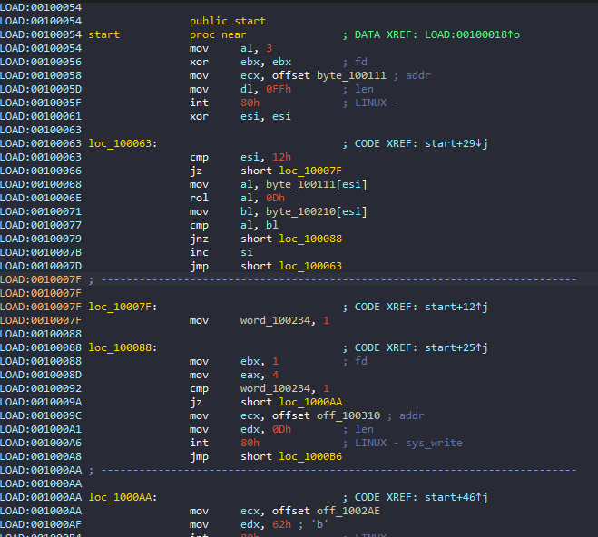

Take our input and store in `byte_100111` loop 18 times, take each char from our input then `rol 0xd` and compare with `byte_100210`.

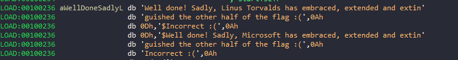

After check return `Incorect :(` or `$Well done! Sadly, Microsoft has embraced, extended and extinguished the other half of the flag :(`...

take consider `(flag_encrypted)`

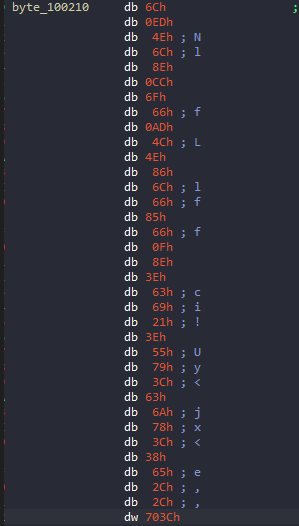

i saw it as 36 bytes instead 18

Use `get_bytes(0x100210,36)` in IdaPython:


With the the first 18 bytes we can easily reverse the flow

```python
from pwn import ror
data = b'l\xedNl\x8e\xccof\xadLN\x86lf\x85f\x0f\x8e>ci!>Uy<cjx<8e,,<p'

flag = ""
for i in data:
    flag+=chr(ror(i,13,8))
print(flag)
```

what it look like

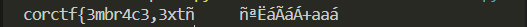

it only half of the flag

Double check in IDA for the missing half

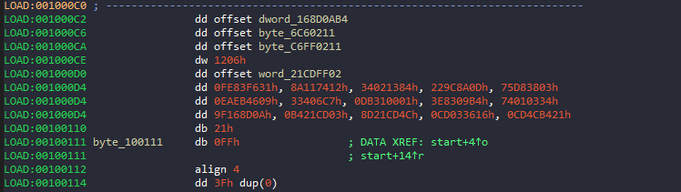

use 'c' to concat to code


similar above, instead of using `rol` it used `pushf` and,.. Might becuase of my ida version or some how it didn't show up.

by this point, i'm thinking of brute forcing `>ci!>Uy<cjx<8e,,<p`. however it seem like a simple `xor with 0xd`.

```python
from pwn import *
data = b'l\xedNl\x8e\xccof\xadLN\x86lf\x85f\x0f\x8e>ci!>Uy<cjx<8e,,<p'

flag = ""
for i in data[:18]:
    flag+=chr(ror(i,13,8))
print(flag)

last = b'>ci!>Uy<cjx<8e,,<p'
print(flag + str(xor(last,0xd)))
```
Together we have this flag:

Flag: ```corctf{3mbr4c3,3xt3nd,3Xt1ngu15h!!1}```

## turbocrab 

> **Description:**
🚀🚀 blazinglyer faster 🚀🚀
SHA256 hash of the flag: `dc136f8bf4ba6cc1b3d2f35708a0b2b55cb32c2deb03bdab1e45fcd1102ae00a`
**Attachment file:**
[turbocrab](https://static.cor.team/uploads/c151963ea732b096d482896731662b367e7c50b12fc1427d0461319d01bd9a04/turbocrab)

Normal ELF, unpack and check flag.

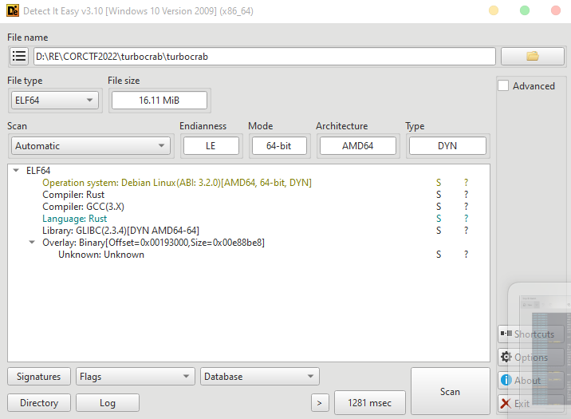

Static anslysis with IDA
Since program written in `rust` which i have non-experience in it, so i gonna use tab`string`(look for text "Flag is incorrect!") reference to it:

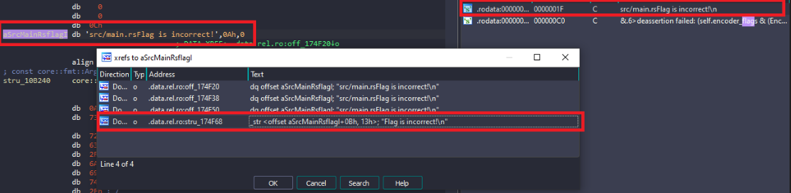

```rust
void __cdecl turbocrab::execute_shellcode::h6984ce5848b31780(__u8_ shellcode)
{
  __u8_ v1; // rdi
  __int64 v2; // r15
  __int64 v3; // rdx
  usize v4; // [rsp+8h] [rbp-190h]
  u8 *v5; // [rsp+10h] [rbp-188h]
  usize len; // [rsp+20h] [rbp-178h]
  __int64 count; // [rsp+28h] [rbp-170h]
  core::ffi::c_void *src; // [rsp+30h] [rbp-168h]
  core::ffi::c_void *dst; // [rsp+48h] [rbp-150h]
  _BYTE v10[29]; // [rsp+63h] [rbp-135h] BYREF
  alloc::vec::Vec<u8,alloc::alloc::Global> self; // [rsp+80h] [rbp-118h] BYREF
  u8 *v12; // [rsp+98h] [rbp-100h]
  __int64 v13; // [rsp+A0h] [rbp-F8h] BYREF
  core::fmt::Arguments v14; // [rsp+A8h] [rbp-F0h] BYREF
  core::fmt::Arguments v15; // [rsp+D8h] [rbp-C0h] BYREF
  __u8_ v16; // [rsp+108h] [rbp-90h]
  core::ffi::c_void *v17; // [rsp+118h] [rbp-80h]
  __int64 *v18; // [rsp+130h] [rbp-68h]
  __int64 v19; // [rsp+138h] [rbp-60h]
  __int64 v20; // [rsp+140h] [rbp-58h]
  __int64 v21; // [rsp+148h] [rbp-50h]
  core::ffi::c_void *v22; // [rsp+150h] [rbp-48h]
  core::ffi::c_void *v23; // [rsp+158h] [rbp-40h]
  __int64 v24; // [rsp+160h] [rbp-38h]
  __int64 v25; // [rsp+168h] [rbp-30h]
  u8 *v26; // [rsp+170h] [rbp-28h]
  __int64 v27; // [rsp+178h] [rbp-20h]
  u8 *v28; // [rsp+180h] [rbp-18h]

  v16 = shellcode;
  v25 = 0LL;
  dst = (core::ffi::c_void *)mmap(0LL, shellcode.length, 3, 33, -1, 0LL);
  v17 = dst;
  qmemcpy(v10, "R^CRIWJM<6.[5I.G`.C3G3CB5_V?P", sizeof(v10));
  alloc::vec::from_elem::hba0d51ad3cb1207d(&self, 0, 0x4000uLL);
  v26 = alloc::vec::Vec$LT$T$C$A$GT$::as_ptr::h0252951c7d91d004(&self);
  v27 = 49602LL;
  v28 = v26 + 49602;
  v12 = v26 + 49602;
  src = (core::ffi::c_void *)core::slice::_$LT$impl$u20$$u5b$T$u5d$$GT$::as_ptr::h869fdf96852d8c48(shellcode);
  count = core::slice::_$LT$impl$u20$$u5b$T$u5d$$GT$::len::h00af0a2d7a9c0658(shellcode);
  v22 = dst;
  v23 = src;
  v24 = count;
  core::intrinsics::copy::h46e3e522e297e890(src, dst, count);
  len = core::slice::_$LT$impl$u20$$u5b$T$u5d$$GT$::len::h00af0a2d7a9c0658(shellcode);
  mprotect(dst, len, 5);
  v13 = v20;
  v18 = &v13;
  v1.data_ptr = v10;
  v1.length = 29LL;
  v5 = core::slice::_$LT$impl$u20$$u5b$T$u5d$$GT$::as_ptr::h869fdf96852d8c48(v1);
  v1.data_ptr = v10;
  v1.length = 29LL;
  v4 = core::slice::_$LT$impl$u20$$u5b$T$u5d$$GT$::len::h00af0a2d7a9c0658(v1);
  v2 = (__int64)v12;
  v13 = ((__int64 (__fastcall *)(_BYTE *, __int64, __int64, core::ffi::c_void *, u8 *, usize))dst)(
          v10,
          29LL,
          v3,
          dst,
          v5,
          v4);
  v12 = (u8 *)v2;
  v19 = v13;
  v21 = v13;
  if ( v13 == 1 )
    core::fmt::Arguments::new_v1::h610d7aa66ccb1a0c(
      &v14,
      (___str_)__PAIR128__(1LL, &stru_174F78),
      (__core::fmt::ArgumentV1_)(unsigned __int64)&stru_10B240);
  else
    core::fmt::Arguments::new_v1::h610d7aa66ccb1a0c(
      &v15,
      (___str_)__PAIR128__(1LL, &stru_174F68),
      (__core::fmt::ArgumentV1_)(unsigned __int64)&stru_10B240);
  std::io::stdio::_print::hccc6c4adfff98fee();
  core::ptr::drop_in_place$LT$alloc..vec..Vec$LT$u8$GT$$GT$::h34608ea8b4b90afb(&self);
}
```

this look like an encrypted flag

```qmemcpy(v10, "R^CRIWJM<6.[5I.G`.C3G3CB5_V?P", sizeof(v10));``` 

Then lots of shellcodes

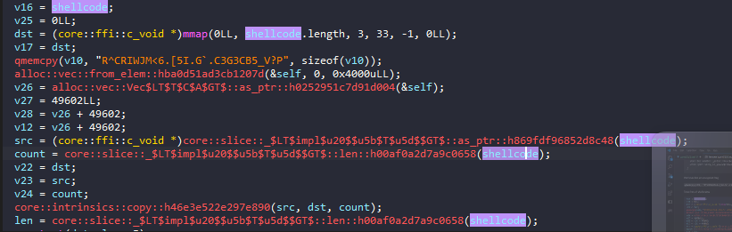

Also variable `v13` use for splitting Correct! and Incorrect!:

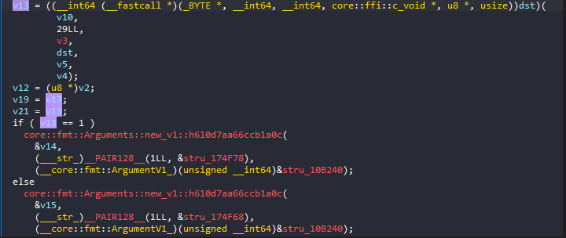

return after "dst" call.

dst might contain shellcode setup vm, breakpoint and debug to know what it doing 
`Note`: For begginer like me, we can use both wsl and a vm as long as we running the linux_server file which we can find in IDA folder in /dbgsrv . Set up the parameter for the debug options then we ready to go . also the binary file also need to we on the same location as the server file otherwise it can copy it which sometimes might be a problem there and i recommned using the vm instead of wsl, wsl may sometimes crash when i use it.

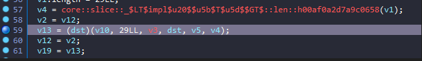

Hit the breakpoint, then `f7` for step into
look for what inside "dst" :
 
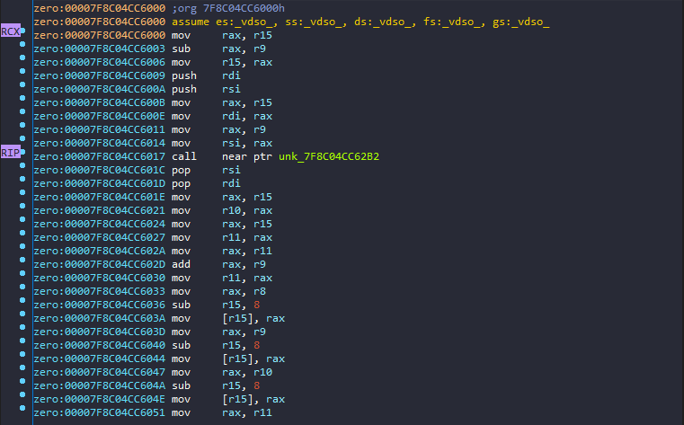

until `call    near ptr unk_7F8C04CC62B2`, it required input, so i try "abcdefgh"

by then encrypted flag and our input loaded in.

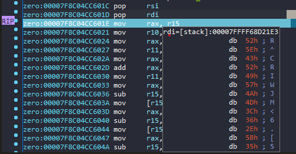

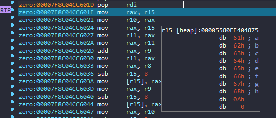

Continue trace and debug, it take each byte of our input `c`, then:
`c^0x13 - 0x1e` and compare with each char from flag encrypted.

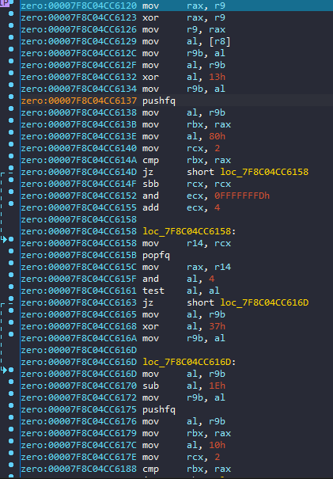

Rev time!!

```python
fl = b"R^CRIWJM<6.[5I.G`.C3G3CB5_V?P"
s = ""
j = 0
for i in fl:
    s+=chr((i+0x1E)^0x13)
print(s) #corctf{xIG_j@t_vm_rBvBrs@ngN}
```
but wrong, might be missing something
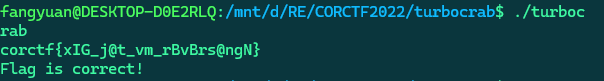
the SHA256 key provide by the challenge

```corctf{xIG_j@t_vm_rBvBrs@ngN}```

My this i think of brute forceing but didn't solve it, after the events end and viewing hint from other players and also asking the author here is what we do.

```python
from pwn import *
fl = b"R^CRIWJM<6.[5I.G`.C3G3CB5_V?P"
s = ""
j = 0
for i in fl:
    s+=chr((i+0x1E)^0x13)
print(s)
hashflag = "dc136f8bf4ba6cc1b3d2f35708a0b2b55cb32c2deb03bdab1e45fcd1102ae00a"

xflag = "corctf{xIG_j@t_vm_rBvBrs@ngN}"
for I in range(0xf7):
    for G in range(0xf7):
        for a in ['1','i','I']:
            for B in ['3','e','E',]:
                for N in range(0xf7):
                    temp = xflag.replace('I',chr(I)).replace('G',chr(G)).replace('@',a).replace('B',B).replace('N',chr(N))
                    hashed_string = hashlib.sha256(temp.encode('utf-8')).hexdigest()
                    if hashed_string==hashflag:
                        print(temp)
                        exit(0)
            #corctf{x86_j1t_vm_r3v3rs1ng?}
```

Flag: ```corctf{x86_j1t_vm_r3v3rs1ng?}```

## msfrob 

> **Description:**
6b0a444558474b460a5a58454d584b470a5f5943444d0a444558474b460a4d464348490a4c5f44495e4345445904
**Attachment file:**
[msfrob](https://static.cor.team/uploads/48fcb317ca7280353ab06e4867f510740046ad9e65eaa9a3fc5e97095fbbf9d7/msfrob)

Open with DiE

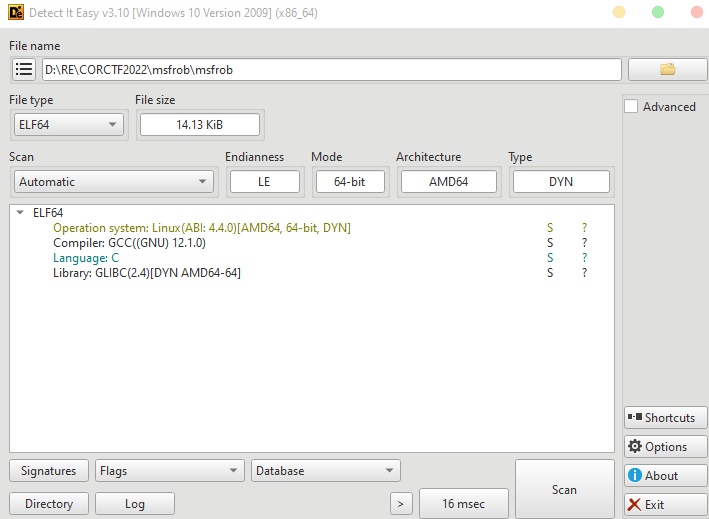

IDA static analysis 

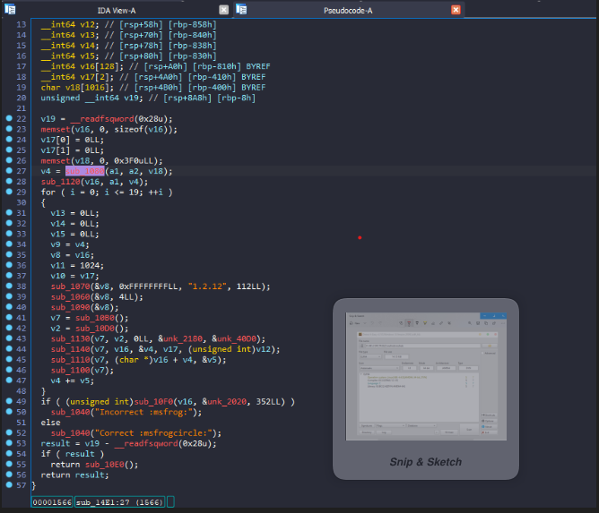

the program take out input through agrv then loop 20, however IDA didn't recogninese any of these. I have spent so much time looking for way to understand it. Then accidently on the internet i saw, people use tracing in IDA for detect functions that get imported from the libary so we have to setup a trace functions and call stack, modules to look for what functions being imported. 

This challenge also took me most of the time, since also error when running 

I've to look up for the missing libs that the program required, and insall it, also my wsl dont really accept it might be beauce missing some required libs

`libcrypto.so.1.1`, isntall openssl as version 1.1 too.

after fixing

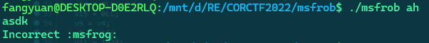

before going the loop it go through 2 functions, which dont really important so we can pass on it without tracing

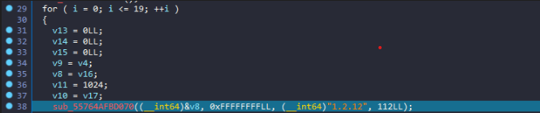

before calling the first functioin in the loop.


Trace each by set breakpoint after the function call, by then we have the complete source code here.


```c
__int64 __fastcall sub_55A613A3B4E1(__int64 input, __int64 a2)
{
  __int64 aes; // rax
  __int64 result; // rax
  int len_out; // [rsp+1Ch] [rbp-894h] BYREF
  int blocksize; // [rsp+20h] [rbp-890h] BYREF
  int i; // [rsp+24h] [rbp-88Ch]
  __int64 CipherCTX; // [rsp+28h] [rbp-888h]
  __int64 *v8; // [rsp+30h] [rbp-880h] BYREF
  int v9; // [rsp+38h] [rbp-878h]
  __int64 *v10; // [rsp+48h] [rbp-868h]
  int v11; // [rsp+50h] [rbp-860h]
  __int64 len_in; // [rsp+58h] [rbp-858h]
  __int64 v13; // [rsp+70h] [rbp-840h]
  __int64 v14; // [rsp+78h] [rbp-838h]
  __int64 v15; // [rsp+80h] [rbp-830h]
  __int64 buf_out[128]; // [rsp+A0h] [rbp-810h] BYREF
  __int64 buf_in[2]; // [rsp+4A0h] [rbp-410h] BYREF
  char v18[1016]; // [rsp+4B0h] [rbp-400h] BYREF
  unsigned __int64 v19; // [rsp+8A8h] [rbp-8h]

  v19 = __readfsqword(0x28u);
  memset(buf_out, 0, sizeof(buf_out));
  buf_in[0] = 0LL;
  buf_in[1] = 0LL;
  memset(v18, 0, 0x3F0uLL);
  len_out = sub_55A613A3B080(input, a2, v18);
  sub_55A613A3B120();
  for ( i = 0; i <= 19; ++i )
  {
    v13 = 0LL;
    v14 = 0LL;
    v15 = 0LL;
    v9 = len_out;
    v8 = buf_out;
    v11 = 1024;
    v10 = buf_in;
    Deflate_init((__int64)&v8, 0xFFFFFFFFLL, (__int64)"1.2.12", 112LL);
    Deflate(&v8, 4LL);
    Deflate_end(&v8);
    CipherCTX = CIPHER_CTX_new();
    aes = Aes_256_cbc();
    Encrypt_init(CipherCTX, aes, 0LL, (__int64)&key, (__int64)&iv);

    EncryptUpdate(CipherCTX, buf_out, &len_out, buf_in, (unsigned int)len_in);
    EncryptFinal_ex(CipherCTX, (char *)buf_out + len_out, &blocksize);
    CIPHER_CTX_free(CipherCTX);
    len_out += blocksize;
  }
  if ( (unsigned int)sub_55A613A3B0F0(buf_out, &byte, 352LL) )
    sub_55A613A3B040("Incorrect :msfrog:");
  else
    sub_55A613A3B040("Correct :msfrogcircle:");
  result = v19 - __readfsqword(0x28u);
  if ( result )
    return sub_55A613A3B0E0();
  return result;
}
```

Our `input` got deflate (compress) and 16 bytes of compressed_data got encrypt with AES_CBC (with key, iv known, `EncryptUpdate()`) and function `Encrypt_final_ex()` encrypted the other compressed_data then store in the beginning

compressed_data have `16 < lenght < 32` with output store on buf_out with length 32. In the next loop, it take 32 bytes then compress and repeat like the previous, buf_out now has length 48 until length = 352 (repeat until 20) then exit, Here is what is look like when transfer to code in python

```python

from Crypto.Cipher import AES
from Crypto.Util.Padding import pad, unpad
import zlib

byte = b'L\xef4\xfa\xd1%EK\xe7\xad\x99\xc4\xb1\xd7\xf6,[\xf3\x13\xbf\xcc\x03\x1d\x16\x81\xdbP8\xa8\xb6\xdd \x90*n\xa2\xef\xfek\x8f\xdb\x80opt\xeb}6\xe4\xdc\x87\xf3 \xeb\xe5\x0f>(5X\xad\x07\xd2=\xd8]A5^OA\x9b\x91\x85\xe1\\\x18\xb8\xf6Z\xdf\x0851\x04\xd2\xe0Dd\xfc\x06\xc6\xd6[\x98 O\x1c\x1e\xb8 \xd5\x9e\xda\x81\xd66[U`\xa8,\xf2\xdaW\x92\xc9\xe0\x14\xf0CK.\x11\xd3pg\xa8U\x08}\xc7vOw\xe8\xbe\xf3\x19\x04\x84\xb2\xa0 \xdcL\xd2\xc8\x94\x17\x9buOx55\xe6bt-\x0c\xa84\xf1\x90\xa9\xfdY\xd4\xf8$\xb9;\x94\xbdy\xc7x\xb9V\xc1\xe3\xb6.\x17:2\xf9NG\xf9\t\xc4\xe8\xfaISj\x0b\xb96\x0b+\\\xc9\xf39c\xb3\xd1\xacpl\xf1FB\xbc\x0b\x91:d\x95w\xec$\x01d\xd2\x98\xe1\xbf8\x17\xd4\xd09\x16\x13\x1d4\xa4\x1a\xfa3_\x88!\xd5\\N\xbf3\x9d\xe1*\xccG\x15\x03\x9d\xa6\x856-m1\x01=\x95\x08\xdcr\xd3\xf6\xf7e\xb7\xc0\x95]\xf4\xc9\xa7\xfa\xdc\xefQ6\xc1\x1d\xe6\x08\xeb\x8a\xec]\xc9Z=\xd3\x9a\xa6\xad(\x99$\x88\x92@-\xab\x12Y\xf8\x84G\xb2\xb9H\xf7\x8f\x1e2d\xba$\xd2=\xf3\xc4\x84\xbd\xd2\xe1\x01\x07\xa1v\x18E\x1eT\x91\x93\x11nAT~@\xe7\x02'
key = b'\xd4\xf5\xd9g\x15/w\x7fl|Fs\xf6\xf0\x92\xf0wP;0\x0c\x87\x8a\r\x9c\x1dr\xa2eF\xc8\xdc'

# cipher explain
inp = b'corctf{abcdefgh}'
buf_out = inp
for i in range(20):
    text = zlib.compress(buf_out)
    cipher = AES.new(key, AES.MODE_CBC,iv= (b'\x00'*16))
    first = cipher.encrypt(text[:16])
    final = cipher.encrypt(pad(text[16:],16))
    buf_out = first + final 
print(buf_out)

```
Reverse the logic here.
Final script:

```python
from Crypto.Cipher import AES
from Crypto.Util.Padding import pad, unpad
import zlib

byte = b'L\xef4\xfa\xd1%EK\xe7\xad\x99\xc4\xb1\xd7\xf6,[\xf3\x13\xbf\xcc\x03\x1d\x16\x81\xdbP8\xa8\xb6\xdd \x90*n\xa2\xef\xfek\x8f\xdb\x80opt\xeb}6\xe4\xdc\x87\xf3 \xeb\xe5\x0f>(5X\xad\x07\xd2=\xd8]A5^OA\x9b\x91\x85\xe1\\\x18\xb8\xf6Z\xdf\x0851\x04\xd2\xe0Dd\xfc\x06\xc6\xd6[\x98 O\x1c\x1e\xb8 \xd5\x9e\xda\x81\xd66[U`\xa8,\xf2\xdaW\x92\xc9\xe0\x14\xf0CK.\x11\xd3pg\xa8U\x08}\xc7vOw\xe8\xbe\xf3\x19\x04\x84\xb2\xa0 \xdcL\xd2\xc8\x94\x17\x9buOx55\xe6bt-\x0c\xa84\xf1\x90\xa9\xfdY\xd4\xf8$\xb9;\x94\xbdy\xc7x\xb9V\xc1\xe3\xb6.\x17:2\xf9NG\xf9\t\xc4\xe8\xfaISj\x0b\xb96\x0b+\\\xc9\xf39c\xb3\xd1\xacpl\xf1FB\xbc\x0b\x91:d\x95w\xec$\x01d\xd2\x98\xe1\xbf8\x17\xd4\xd09\x16\x13\x1d4\xa4\x1a\xfa3_\x88!\xd5\\N\xbf3\x9d\xe1*\xccG\x15\x03\x9d\xa6\x856-m1\x01=\x95\x08\xdcr\xd3\xf6\xf7e\xb7\xc0\x95]\xf4\xc9\xa7\xfa\xdc\xefQ6\xc1\x1d\xe6\x08\xeb\x8a\xec]\xc9Z=\xd3\x9a\xa6\xad(\x99$\x88\x92@-\xab\x12Y\xf8\x84G\xb2\xb9H\xf7\x8f\x1e2d\xba$\xd2=\xf3\xc4\x84\xbd\xd2\xe1\x01\x07\xa1v\x18E\x1eT\x91\x93\x11nAT~@\xe7\x02'
key = b'\xd4\xf5\xd9g\x15/w\x7fl|Fs\xf6\xf0\x92\xf0wP;0\x0c\x87\x8a\r\x9c\x1dr\xa2eF\xc8\xdc'

# cipher explain
inp = b'corctf{abcdefgh}'
buf_out = inp
for i in range(20):
    text = zlib.compress(buf_out)
    cipher = AES.new(key, AES.MODE_CBC,iv= (b'\x00'*16))
    first = cipher.encrypt(text[:16])
    final = cipher.encrypt(pad(text[16:],16))
    buf_out = first + final 
print(buf_out)
#rev
p1 = byte[:16]
p2 = byte[16:]
# first = p1
# final = p2
for i in range(20):
    cipher = AES.new(key, AES.MODE_CBC,iv= (b'\x00'*16))
    first = cipher.decrypt(p1)
    final = cipher.decrypt(p2)
    comp_text = first+final
    
    decomp_text = zlib.decompress(comp_text)
    p1 = decomp_text[:16]
    p2 = decomp_text[16:]
    print(decomp_text)
```


Flag: ```corctf{why_w0u1d_4ny0n3_us3_m3mfr0b??}```


## hackermans dungeon 

> **Description:**
Hackerman told us he cannot be hacked. Can you hack hackerman?
**Attachment file:**
[hackermans_dungeon.exe](https://static.cor.team/uploads/42df4d989f27b7bfbd1c66dcc329644bca70a48c717fdb6e65b3ca53c228fd4f/hackermans_dungeon.exe)

This challenge i also not finished during the game time, so now we redo it here

Open with IDA, i also thought we should tracing too, however the other solver use ida plugin which is new to me`findcrypt`.

From the hint, I find it similar to some pieces of code that comes from a well known encryption algorithm. To test my theory, I used findcrypt-yara plugin from IDA to find if there’s any well known constant in an algorithm. And it ended up showing 3 popular ones: CRC32, SHA256 and MD5.

Having those hints, I can easily spot functions that are related to those 3 algorithms:

```c
v29 = 0i64;
v30 = 1732584193;
v20 = -1i64;
v31 = -271733879;
v32 = -1732584194;
v33 = 271733878;
do
++v20;
while ( Src[v20] );
MD5_Init(&v29, Src);
MD5_Final(&v29);
*(_OWORD *)&v28[1] = v34;
do
++v9;
while ( Src[v9] );
SHA256(Src, v9);
if ( !strcmp(Buffer, "CORnwallis") && !memcmp(&unk_7FF7EEF27068, Buf2, 0x20ui64) )
{
memset(v35, 0, sizeof(v35));
CHACHA_Init(v35, Buf2, &v28[1]);
LODWORD(v35[22]) = 42;
v35[15] = 42i64;
v22 = LOBYTE(v35[13]) | ((BYTE1(v35[13]) | (WORD1(v35[13]) << 8)) << 8);
v35[8] = 64i64;
HIDWORD(v35[22]) = LOBYTE(v35[13]) | ((BYTE1(v35[13]) | (WORD1(v35[13]) << 8)) << 8);
v23 = 0i64;
v24 = 64i64;
do
{
    if ( v24 >= 0x40 )
    {
    CHACHA_key_generate(v35);
    v8 = 0i64;
    v35[8] = 0i64;
    }
    v25 = *((_BYTE *)v35 + v8++);
    byte_7FF7EEF27040[v23] ^= v25;
    v24 = v8;
    ++v23;
    v35[8] = v8;
}
while ( v23 < 0x23 );
LODWORD(v28[0]) = 0;
CRC32(v22, v21, v28);

```
These Crypto make head crackkk !!!!! :(((
There is actually one exception that findcrypt-yara can’t figure out, which is CHACHA. But we can easily identify that by finding the string expand 32-byte k in a function and google it, which results in many aritcles about CHACHA.

[rockyou.txt](https://github.com/brannondorsey/naive-hashcat/releases/download/data/rockyou.txt)

```python

from hashlib import sha256
from itertools import count
from pwn import *
from Crypto.Cipher import Salsa20,ChaCha20

from pwn import *
pwhash = b"\x9c\x00\xf1\xaccb\x16\xe24/d\xae;\x82\xe3\xc0'I\xa6\x9c5\xdf\x8c\x03UMU\xc1\x01\x86\x9dG"
# username = b'CORnwallis'
#[patch_byte(0x0B010D3F7F0+i,d) for i,d in zip(range(35),b"\x9c\x00\xf1\xaccb\x16\xe24/d\xae;\x82\xe3\xc0'I\xa6\x9c5\xdf\x8c\x03UMU\xc1\x01\x86\x9dG")]
# byte = b':\xab5\x81\xd5_V\xb0\xce\xe5\xf5\x16M\xb3\x8d-x#\xd0\x1c\x00\xc1\xec\x07\x19\x022\x91J\xb4c\xcc\xed\xd9\x08'

def SUScrypt(password):
    password = [i for i in password]
    lenpw = len(password)
    j = 0
    k = 1
    while j<lenpw:
        password[j]+=1
        password[j] = (~((password[k % lenpw] ^ password[j]) + 98))&0xff;
        k+=1
        j+=1
    return b"".join([i.to_bytes(1,'big') for i in password])
f = open('rockyou.txt','rb').readlines()
for pw in f:
    # print(sha256(SUScrypt(pw[:-1])).digest())
    if sha256(SUScrypt(pw[:-1])).digest()==pwhash:
        print(pw)
        break
```
while checking whether the SUScrypt function works properly, I tried debugging many times, and I found that although there is a md5 section, it does not affect the Buf2 section =)), so it affects another variable, and when I patch buf2, it still does not produce a flag. So while writing the script, I did not use md5

Run a bit and get the password: canthackmehackers
Enter the password, set a breakpoint, bypass anti-debug and check byte_1400740:

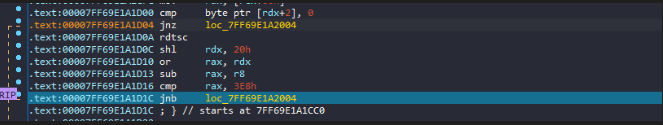

In order to bypass at jnz edit ZeroFlag = 1, and at jnb edit CarryFlag = 1 

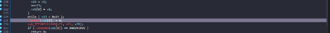

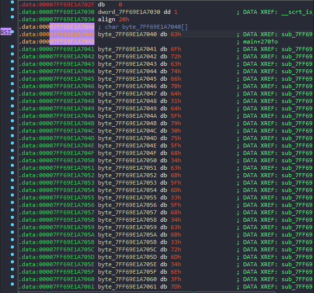

Flag: `corctf{d1d_y0u_h4ck_m3_h4ck3rm4n?}`

Done!